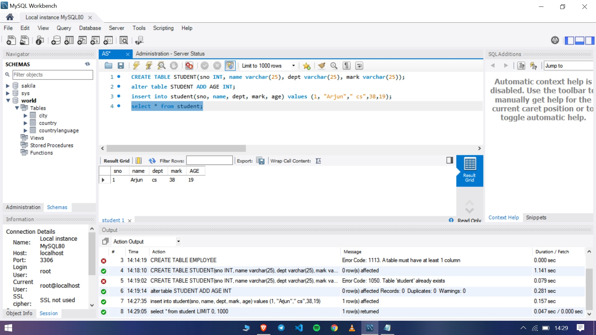
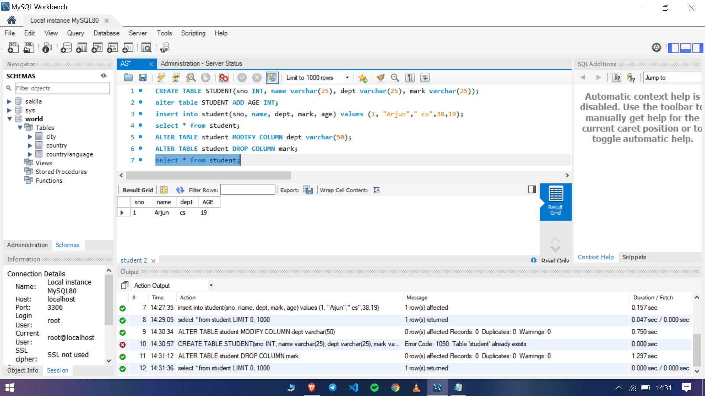
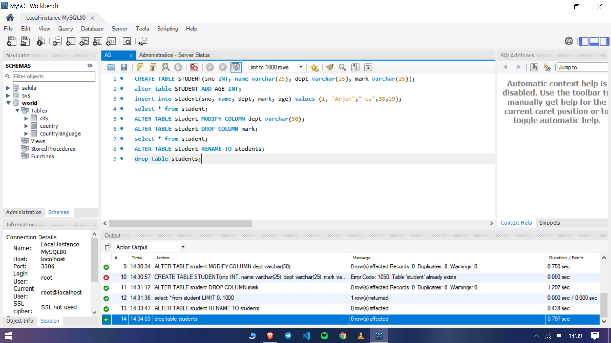

### Program 1

- Create a table student with attributes sno,name marks and dept
- Add a new attribute age
- Change the datatype size of dept
- Delete the attribute marks from the table
- Change the name of the student table to students
- Delete all values from the table
- Delete the entire table

The commands used are in the sql file [here](https://github.com/arjun-g-krishna/application-software-cs333/blob/main/program-1/commands.sql)

### Output screenshots

