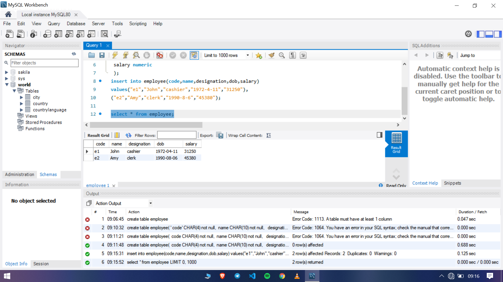
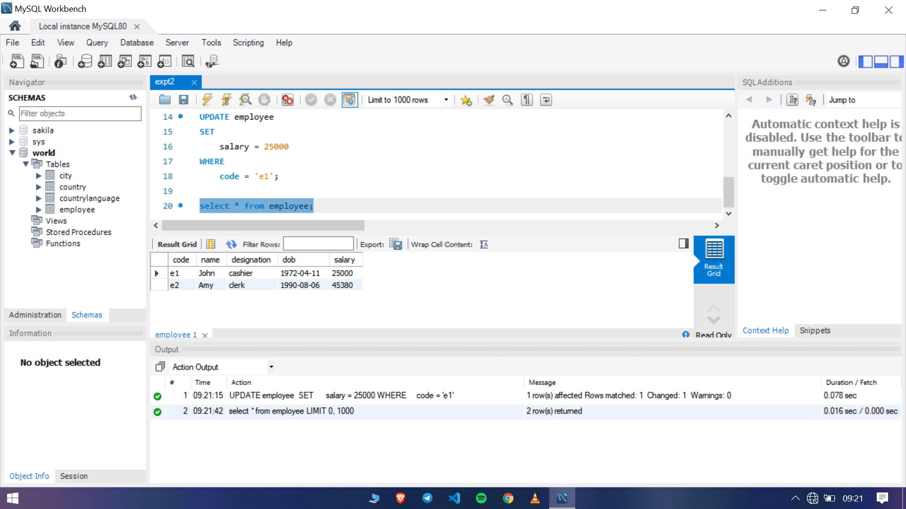
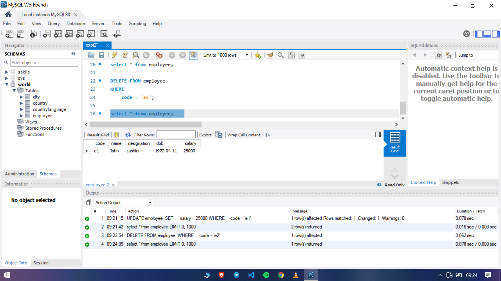

### Program 2

The sql file used in the experiment can be found [here](expt2.sql)

- Create a table employee with following specifications

code character(4), name character(10), designation character(30), dob date, salary numeric

- Insert two tuples into the table

- Select all details from the table

- Change the salary of employee whose code is e1

- Delete a tuple from the table employee

