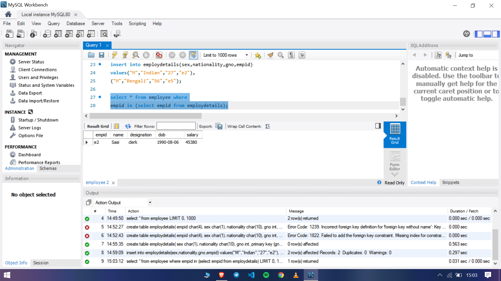
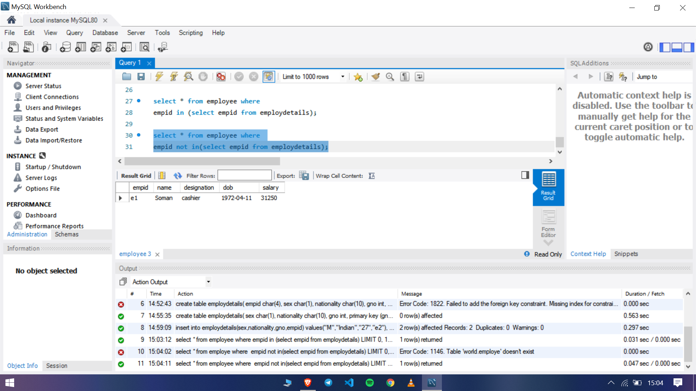

### Program 3

- Create table employdetails with empid references to the empid in employee table
- Display the details of employee table where empid in employedetails table
- Display the details of employee table where empid notin employedetails table

Two tables employee and employedetails.empid attribute in employee  refer empid attribute in employee details table
Other attributes in table are up to you.but must have empid in both table to make relationship between two.

### Output

The sql file used in the experiment can be found [here.](expt3.sql)

