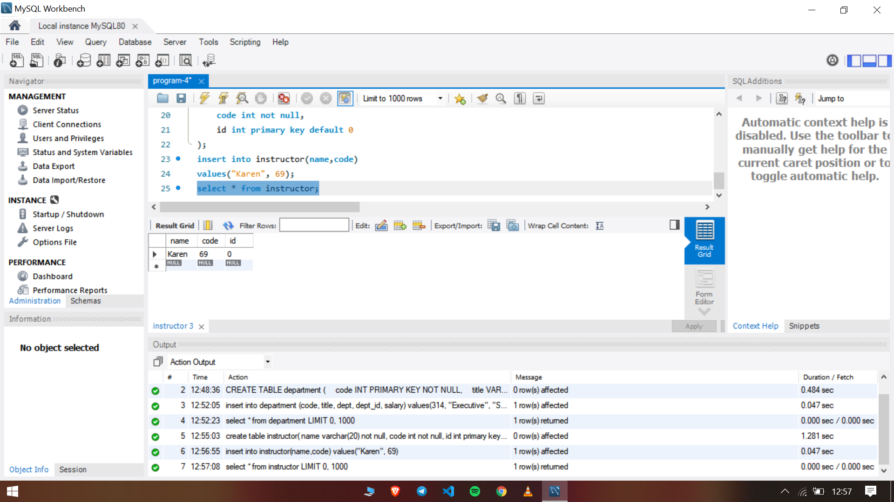

### Program 4

Create and insert values for the following tables department and instructor(with constarints)

1. Department Table

- Code(primary key)
- Title
- Dept_name (unique)
- Dept_id
- Salary(check –salary>2000)

2. Instructor table
- Name(not null)
- Code
- Id(default)

The SQL file used in the experiment can be found [here](expt4.sql)

### Output Screenshots

