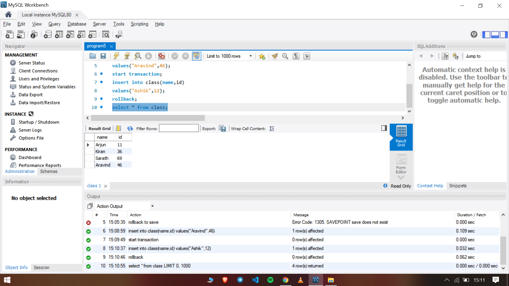
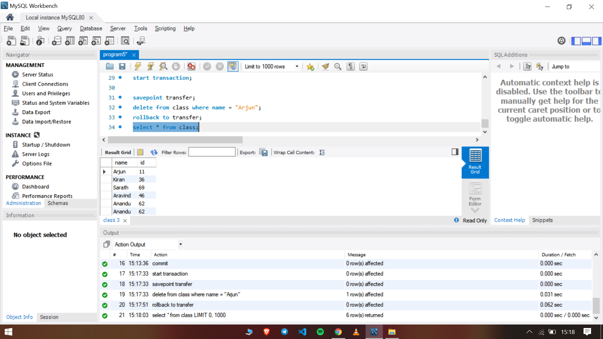

### Program 5

Practice of SQL TCL commands like rollback, commit and savepoint

- Create a table class, fields are name and id
- Insert values into the table
- Display the table
- Apply commit, savepoint and rollback commands

### Output 

The SQL file used can be found [here](program5.sql)

Commit and Rollback command

Savepoint command

