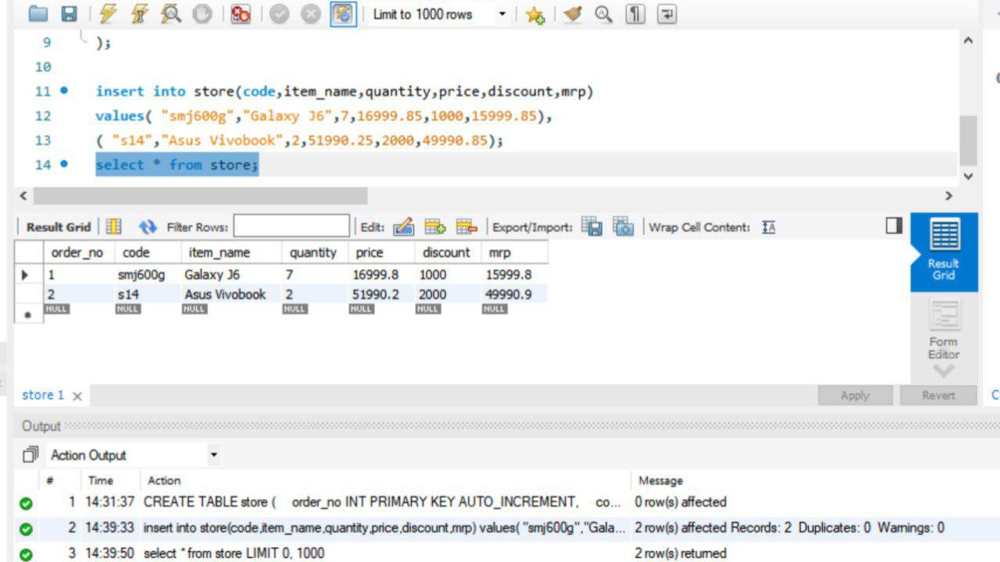
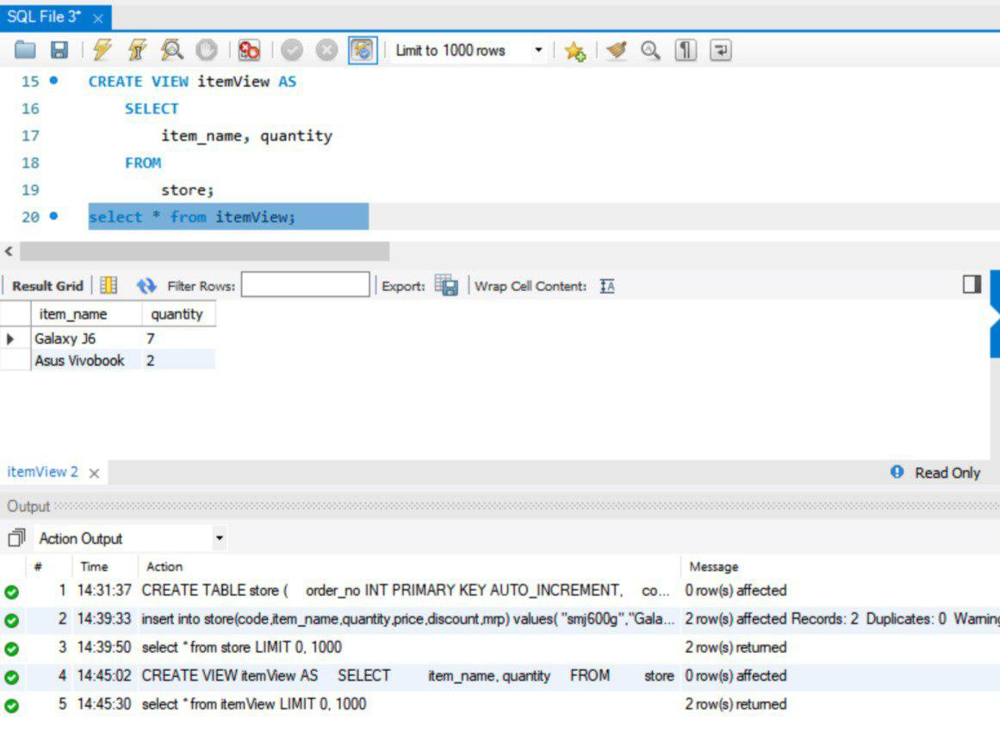
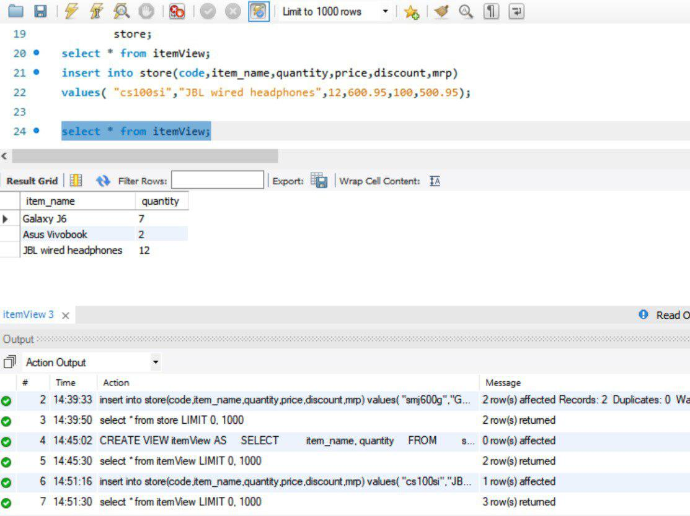

## Program 6
Creation of Views and Assertions

1. Create a table store. Fields are order no, code, item, quantity, price, discount, mrp
2. Insert values into the table
3. Display the table
4. Create a view with item_name and quantity for the above table
5. Write a query to check whether any changes made to present table is reflected in view.
6. Write a query to delete a view

The source code used in this program can be found [here](program-6.sql)
### Output screenshots

- Creating a table store. Fields are order no, code, item, quantity, price, discount, mrp and inserting values into the table

- Create a view with item_name and quantity for the above table

- Write a query to check whether any changes made to present table is reflected in view.

