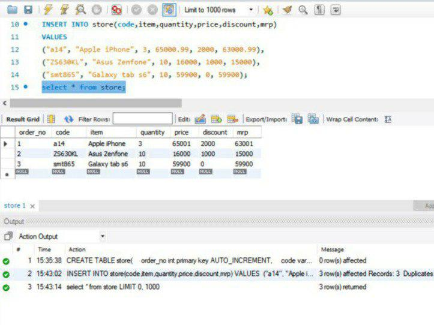

## Program 7

Implementation of Built in functions in RDBMS

- Create a table store. Fields are order no, code, item, quantity, price, discount, mrp
- Insert values into the table
- Display the table
- Write an SQL query to display the reminder, if the amount of an each item in store is divided by 9.
- Write SQL query to display the amount in store and its square
- Write SQL query to divide the amount in stock of each item by 7 in store table and display the result round to the nearest integer.

Use built-in functions like mod() power() and round().

The sql file used in this experiment can be found [here](program7.sql)

### Output

- Creating the table, inserting values and displaying it 

- Write an SQL query to display the reminder, if the amount of an each item in store is divided by 9.

- Write SQL query to display the amount in store and its square

- Write SQL query to divide the amount in stock of each item by 7 in store table and display the result round to the nearest integer.

