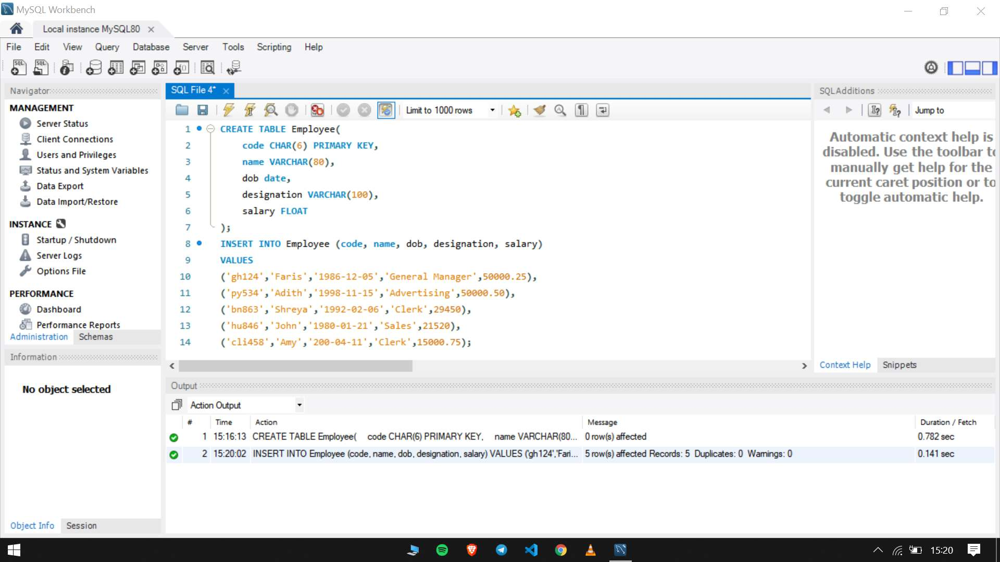
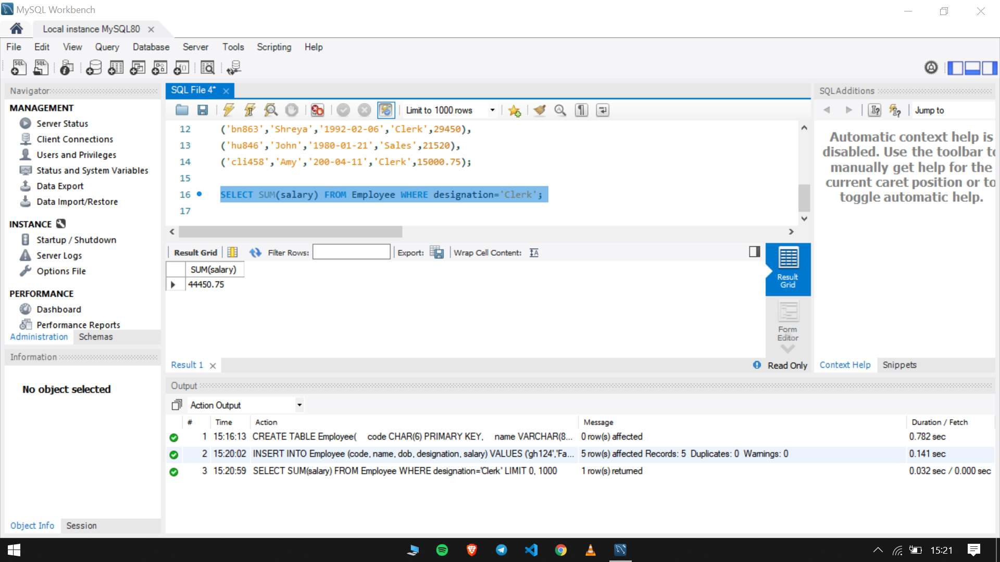
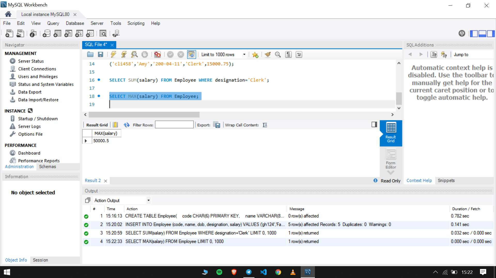
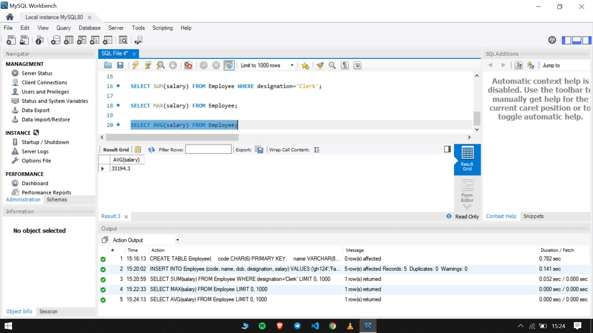
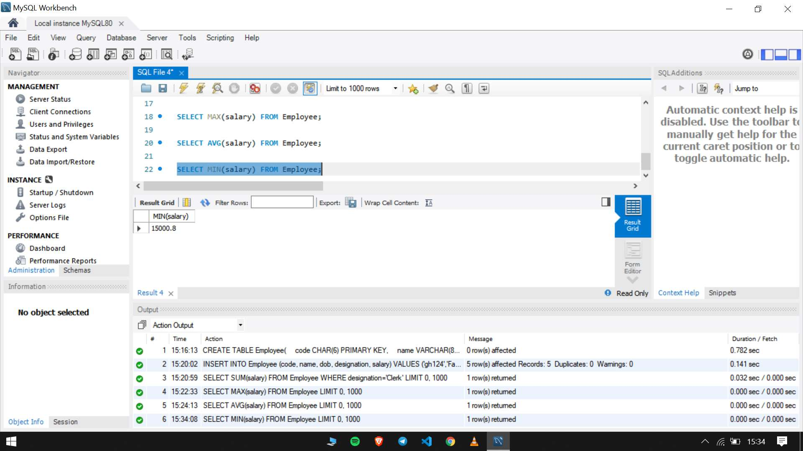
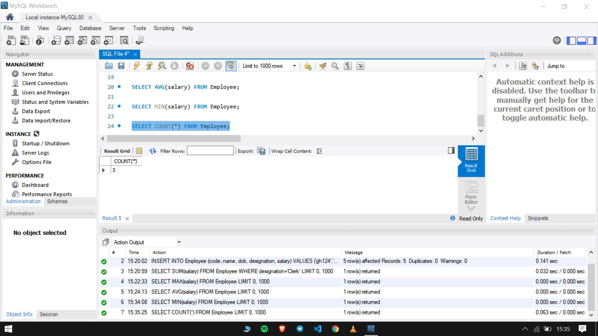

##  Program 8

Implementation of various aggregate functions in SQL

- Create a table Employee with following specifications.
- Code, name, DOB, designation, salary
- Insert values into the table
- Display sum of salaries from the table employee where designation is clerk.
- Describe the maximum salary value from the table employee.
- Display average salary of employees
- Describe the minimum salary value from the table
- Display the total number of employees.

The sql file used in the experiment can be found [here](program8.sql)

### Output

- Create a table Employee with following specifications. Code, name, DOB, designation, salary Insert values into the table.

- Display sum of salaries from the table employee where designation is clerk.

- Describe the maximum salary value from the table employee.

- Display average salary of employees

- Describe the minimum salary value from the table

- Display the total number of employees.

