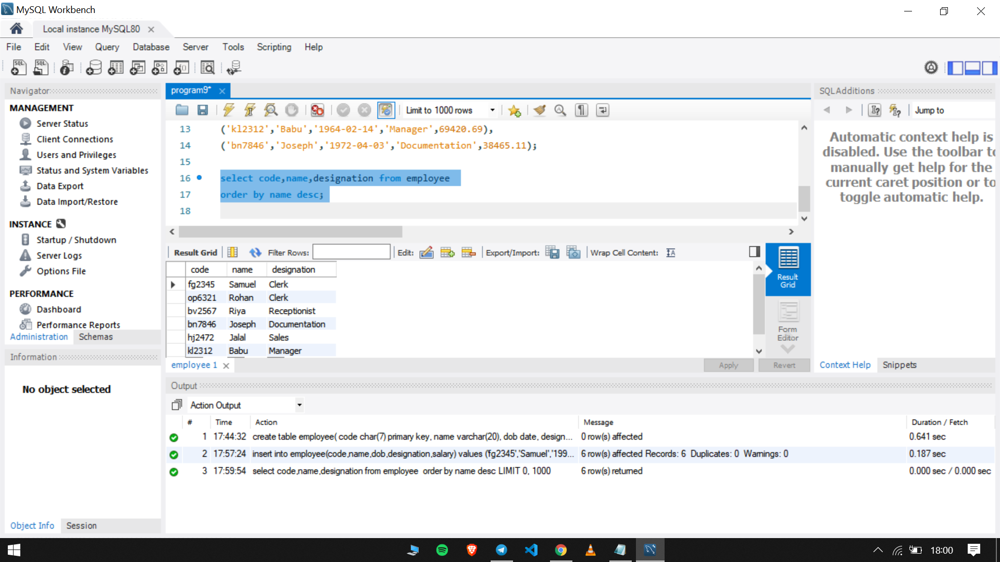
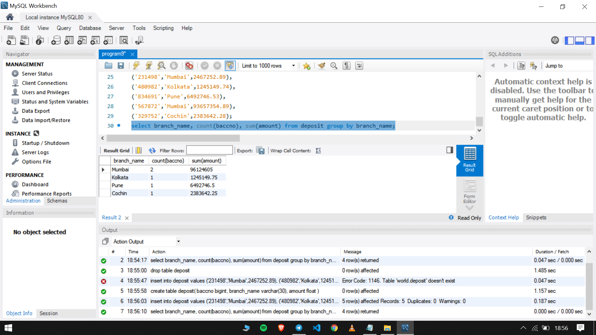

## Program 9

Order by and Group by clause

- Create table employee with fields Code , name , dob , designation , salary.
- Display code, name, and designation in descending order of the name.
- Create table deposit with fields baccno , branch_name , amount .
- Give branch name and details of deposit table.

The sql file used in this experiment can be found [here](program9.sql)

### Output

- Create table employee with fields Code , name , dob , designation , salary. Display code, name, and designation in descending order of the name.

- Create table deposit with fields baccno , branch_name , amount . Give branch name and details of deposit table.

